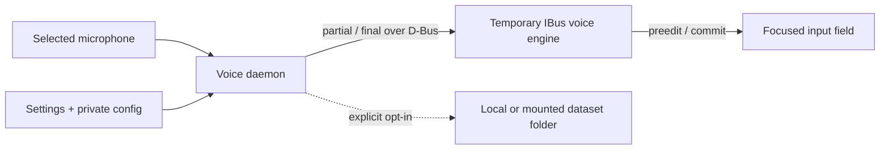

<div align="center">
  
  <h1>Open Voice Input Linux</h1>
  <p><strong>Native adaptive voice input for Linux: speak, and text appears at the caret.</strong></p>
  <p>Built for Ubuntu, IBus and Chinese-first workflows—without clipboard paste,
  <code>Ctrl+V</code>, or simulated per-character typing.</p>
  <p><a href="README.md">简体中文</a> · <strong>English</strong></p>
  <p>
    <a href="https://github.com/SidUParis/openVoiceInput_linux/actions/workflows/ci.yml"></a>
    <a href="https://github.com/SidUParis/openVoiceInput_linux/releases"></a>
    <a href="LICENSE"></a>
  </p>
  <strong>Text at the caret</strong> · <strong>No clipboard paste</strong> ·
  <strong>~404 KiB .deb</strong> · <strong>Collection off by default</strong>
</div>


_This interaction concept animation uses synthetic text to illustrate the
implemented caret-local flow. It is not a screen recording or ASR call; real
dictation uses the online provider selected by the user._

> [!IMPORTANT]
> This is the secondary English edition of a public alpha for **Ubuntu 24.04
> x86_64 + IBus**. The project currently serves Chinese users first; see the
> [Chinese landing page](README.md) for the canonical product overview. Real
> dictation uses the user's own account for the selected online ASR provider
> and may incur that provider's fees. Volcengine is the default and the only
> path validated with a real key on the maintainer workstation; Qwen and
> OpenAI remain experimental, without real-key acceptance in this release.

## Install on Ubuntu

The current package target is **Ubuntu 24.04 x86_64 with IBus**. Download the
`.deb` from the matching signed entry on the
[Releases page](https://github.com/SidUParis/openVoiceInput_linux/releases),
then install it locally:

```bash
sudo apt install ./open-voice-input-linux_*_amd64.deb
```

Open **Open Voice Input Linux** from the application menu, choose an ASR
provider, save that provider's API key, arrange microphone priority for your
equipment and workflow, and enable the service. The current alpha does not
install a system-wide shortcut automatically; bind any key you prefer to:

```bash
murmur-voice-daemon toggle
```

The settings window also offers push-to-talk. An integration with genuine
key-down/key-up events calls `murmur-voice-daemon press` on press and
`murmur-voice-daemon release` on release. The project does not hard-code Right
Alt or any other key. Normal GNOME/KDE shortcuts provide an activation event
and suit `toggle`; generic Wayland shortcuts do not guarantee global release,
so push-to-talk requires a desktop, keyboard, or accessibility tool that
really supplies both edges. The package does not scan all `/dev/input` devices.

The `.deb` is the normal evaluation path. Maintainers and users who need to
verify every bundled wheel, hash and SBOM can instead follow the
[reproducible preview archive procedure](docs/offline-preview.md).

## Why this is different

### Native text at the caret

Partial recognition is rendered with IBus preedit in the focused field, then
one authoritative final is committed exactly once. The normal path does not
open a transcription window, read the clipboard, paste with `Ctrl+V`, or
simulate typing.

### Learns a precise correction, not your whole document

After a final commit, the engine can observe the same IBus field for at most
five seconds. One strong spelling or terminology replacement can activate;
several independent edits are retained as review candidates, while conflicts
stay isolated. Settings shows the latest reason and offers an explicit
provider-text / preferred-text fallback for applications without trustworthy
IBus surrounding-text support. It does not monitor global keys, AT-SPI, the
clipboard, Rime history, or unrelated text.

This event-driven observation is enabled by default after a nonempty final in
the current alpha; the Settings window does not yet expose a disable switch.
The next toggle, focus loss, cancellation or timeout ends it.

### Your optional dataset stays under your control

Collection is off by default. When explicitly enabled, an accepted utterance
can be retained as its exact 16 kHz mono WAV plus a versioned JSON record in a
local or already-mounted folder selected by the user. In this alpha the JSON
contains an **unreviewed provider result**; user edits do not yet backfill the
training record, and `spoken_verbatim` / `preferred_output` remain unset until
a future review workflow.

The immutable utterance directory remains the two-file `audio.wav` +
`record.json` contract. Captured correction decisions are append-only events
below `feedback/<utterance_id>/`; they do not rewrite the base record. A separate transcript-free
`usage/<utterance_id>.json` index powers the dashboard's daily and cumulative
counts. The dashboard reads that index in the background; it never opens or
shows transcript labels. Collection-off does not scan an old destination, and
a disconnected mount is shown as unavailable rather than as zero usage.

### A lightweight client, not a bundled model

The official alpha.4 Debian package is **413,736 bytes (about 404 KiB)**, and
its package metadata reports an **Installed-Size of 2,776 KiB (about 2.7
MiB)**. It uses Ubuntu's existing Python, GTK, IBus and audio components. It
does not bundle Electron or local ASR model weights, and it does not download a
model on first launch.

This is what “lightweight client” means here; it does not mean offline speech
recognition. The current ASR path still uses the online provider configured by
the user. On a fresh Ubuntu installation, APT may download additional system
dependencies, so the total network download depends on what is already
installed.

## Cloud, privacy and cost

**Volcengine BigModel ASR 2.0** remains the default and the only provider path
validated with a real key on the maintainer workstation. Alpha.5 also contains
reviewed Qwen streaming and OpenAI batch transcription adapters; both have
fake-transport protocol coverage but no real-key acceptance claim yet. MiniMax
is visibly planned rather than backed by an invented undocumented endpoint.
Every provider requires the user's own account and billing. The project ships
no shared key and no local ASR; see [provider details](docs/provider-backends.md).

Audio, quota, billing, regional processing, and server-side retention are
governed by the selected provider and the user's account configuration.

The voice path is transcription, not generative writing. Provider-side DDC,
punctuation, segmentation and inverse text normalization may clean a faithful
transcript, but the application does not expand a short instruction into an
email or invent new content.

Audio is uploaded only after the user starts a dictation. Cancelling prevents
a local commit but cannot retract audio already sent to the provider. Optional
WAV/JSON collection is a separate opt-in and does not replace the provider
upload. Read the [privacy notice](docs/privacy.md) and
[threat model](docs/threat-model.md) before using sensitive material.

## Current compatibility

| Area | Current alpha status |
| --- | --- |
| Operating system | Ubuntu 24.04 x86_64 is the packaging and CI target; clean-machine, real microphone/provider validation is still being expanded |
| Desktop input | IBus applications with preedit support; X11 and Wayland application coverage is still being documented |
| Keyboard IME | The alpha temporarily switches to `murmur-voice` for dictation and correction observation, then restores the exact previous IBus engine |
| Chinese typing | Permanent librime / Rime Ice keyboard-and-voice integration is planned, not yet complete |
| Speech provider | Volcengine is the default and real-key-validated path; Qwen streaming and OpenAI batch transcription are experimental and fake-transport-tested only; MiniMax is planned and not selectable |
| Local / offline ASR | Not implemented yet |
| Shortcut / indicator | A shortcut must currently be configured by the user; a separate compatibility controller is not part of this repository's daemon package |
| Password and private fields | Voice acquisition is refused for protected, fake or unsupported input contexts |

See [known changes and limitations](CHANGELOG.md) and the
[roadmap](ROADMAP.md) before relying on the alpha for daily work.

## What works now

- Cumulative partial text at the active caret and one authoritative final
  commit, without clipboard paste.
- Focus token, D-Bus sender, utterance ID and monotonically increasing revision
  checks; stale or late results are rejected.
- Cancellation on focus loss, engine disable or sidecar disappearance.
- Password, PIN, private, fake and preedit-incompatible contexts are refused.
- A self-contained voice daemon with a 10-minute recording limit, bounded
  pending audio and generation-safe late-callback rejection.
- Fresh microphone selection before every utterance using the user's saved
  priority. If a preferred input is unavailable, the next usable candidate is
  tried automatically. Selection affects this capture stream only and does
  not change the playback device.
- Explicit vocabulary, manual correction pairs and bounded adaptive correction
  memory, reloaded before the next dictation without restarting the service.
- Optional background WAV/JSON publication to an existing local or mounted
  filesystem directory, with no hidden fallback upload.
- A native GTK4 settings window and private mode-0600 control socket.

## Use the alpha

### Configure

After installation, launch **Open Voice Input Linux** from the desktop
menu or run:

```bash
open-voice-input-settings
```

The saved key is never prefilled into the window. Saving a key, vocabulary,
correction, microphone order or collection choice does not contact the
provider or interrupt an active recording. Changes are loaded for the next
dictation.


_Rendered from the current `main` branch with an empty temporary profile; no
saved key or user data appears._

### Start, stop or cancel

The shortcut target uses `toggle`: one invocation starts recording and the
next requests the provider's two-pass final. The same private controller also
supports explicit commands:

```bash
murmur-voice-daemon start
murmur-voice-daemon stop
murmur-voice-daemon press
murmur-voice-daemon release
murmur-voice-daemon cancel
murmur-voice-daemon status
```

`stop` finalizes audio and waits for the authoritative result. `cancel` clears
local preedit and prevents a commit, but cannot undo provider upload that
already happened.

### Optional personal-ASR records

Enable the explicitly labelled WAV + unreviewed `provider_final` collection
checkbox only if you want to retain data. Select an existing absolute local path or an operating-
system-mounted filesystem. The application itself does not log in to a remote
host, mount SSH storage or accept a Google Drive URL. See the
[remote dataset storage guide](docs/remote-dataset-storage.md) for SSHFS and
asynchronous `rclone` backup boundaries.

Direct writes have no local fallback spool. A stalled or disconnected mount
can lose an unpublished staged record, while already published records remain.
The selected filesystem controls its effective access and at-rest protection.

## Architecture and safety boundaries

The current preview deliberately keeps the network-facing voice daemon
separate from the IBus engine:



During dictation and the bounded correction window, the preview temporarily
selects `murmur-voice`; stock Rime composition is not available until the
previous engine is restored. The production goal is one librime-capable engine
for continuous keyboard and voice input. Details are in the
[architecture](docs/architecture.md), [D-Bus contract](docs/dbus-api.md),
[recognition and correction design](docs/recognition-accuracy.md), and
[personal ASR data plan](docs/personal-asr-data-plan.md).

The 0.x line retains historical internal identifiers such as the
`murmur-voice` IBus engine, `org.murmur.IME.Preedit1` bridge and
`$XDG_DATA_HOME/murmur-ime`. These are compatibility ABI, not a second public
product name. The package does not write to `~/.config/ibus/rime` and does not
download code or Rime data during installation.

## Deterministic no-key demo

Contributors can verify the caret-local IBus path without a microphone, API key
or changes to the current desktop session:

```bash
python3 -I scripts/run_isolated_preedit_smoke.py
```

It runs fixed synthetic partial/final text inside private Xvfb, D-Bus and IBus
instances. This checks the real preedit/commit path, but it is not evidence of
microphone quality, provider accuracy, systemd integration or application-wide
compatibility.

## Build and test

To build the Debian package from an exact commit and a prepared offline
wheelhouse, use a clean Ubuntu 24.04 x86_64 checkout whose builder bytes match
that revision:

```bash
./scripts/build-deb.sh \
  --ref EXACT_COMMIT_SHA \
  --wheelhouse /absolute/path/to/wheelhouse \
  --output-dir dist
sudo apt install ./dist/open-voice-input-linux_*_amd64.deb
```

The package owns its root-installed runtime under
`/usr/lib/open-voice-input-linux`, public launchers under `/usr/bin`, and user
unit definitions under `/usr/lib/systemd/user`. It does not enable voice
capture until the user explicitly does so in Settings.

Install from a connected source checkout only when you explicitly accept
development dependency resolution:

```bash
./scripts/install-user.sh --allow-network
```

Run the offline engine and daemon suites with:

```bash
PYTHONPATH=engine python3 -m unittest discover -s engine/tests -v
PYTHONPATH=voice python3 -m pytest -q -p no:cacheprovider voice/tests
```

The tests use synthetic protocol, audio, D-Bus, systemd and IBus boundaries;
they do not call a real microphone, cloud account or editable desktop context.
Release construction, checksum/signature verification and SBOM requirements
are documented in the [release process](docs/release-process.md).

Remove the Debian package with:

```bash
sudo apt remove open-voice-input-linux
```

Removal preserves the user's private key, vocabulary, corrections, collection
choice and external dataset. Delete those only through an explicit user action.

## Documentation

- [中文安装与使用指南](docs/README.zh-CN.md)
- [Architecture](docs/architecture.md)
- [Verified compatibility matrix](docs/compatibility-matrix.md)
- [Security model](docs/security.md) and [threat model](docs/threat-model.md)
- [User service, upgrades and uninstall](docs/user-service.md)
- [Recognition accuracy and adaptive corrections](docs/recognition-accuracy.md)
- [Privacy](docs/privacy.md)
- [Personal ASR dataset plan](docs/personal-asr-data-plan.md)
- [Remote and mounted storage](docs/remote-dataset-storage.md)
- [Prototype internals](docs/python-preedit-prototype.md)
- [Launch positioning and demo storyboard](docs/launch-positioning.md)
- [中文产品与发布计划](docs/product-launch-plan.zh-CN.md)
- [中文宣传资料包](docs/press-kit.zh-CN.md)

## License

New original code is licensed under GPL-3.0-only. The design builds around
`ibus-rime` (GPL-3.0-or-later) and `librime` (BSD-3-Clause). Rime Ice is an
external GPL-3.0-only project and is not bundled. Imported files retain their
upstream notices; see [NOTICE.md](NOTICE.md) and the
[licence audit](docs/license-audit.md).

Open Voice Input Linux is an independent community project and is not
affiliated with Rime, Volcengine, ByteDance or Doubao.
