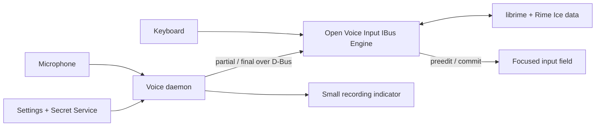

# Open Voice Input Linux

**Rime Ice keyboard input + Volcengine voice dictation, presented as one Linux IBus engine.**

Open Voice Input Linux 是面向 Linux/IBus 的开源中文输入法：键盘输入由
librime + 雾凇拼音负责，语音输入由火山引擎流式 ASR 负责。识别草稿
直接显示在当前应用的输入位置，二遍识别完成后原位提交。

Open Voice Input Linux is an early-stage Linux input method project. Its goal
is to keep the complete local Rime/Rime Ice typing experience while adding
native voice dictation directly inside the focused input field.

Canonical repository:
[github.com/SidUParis/openVoiceInput_linux](https://github.com/SidUParis/openVoiceInput_linux)

The voice path is faithful transcription, not generative writing: live ASR,
two-pass recognition, disfluency removal, punctuation, sentence segmentation,
and inverse text normalization. It does not turn a short instruction into an
email or otherwise invent content.

> **Current status:** the Python IBus inline-preedit prototype is implemented,
> and its bridge to the local Doubao Murmur sidecar has been verified. During
> one recording the bridge temporarily switches `rime → murmur-voice`, streams
> partial/final text over D-Bus, and restores the previous Rime engine on
> final, cancel, or failure. The permanent combined Rime + voice engine is the
> next milestone.

## Why a new IBus engine?

The original Doubao Murmur desktop application did not own the active IBus input
context, so it needed a separate transcription window and clipboard-based
paste. The implemented Python prototype proves the replacement path by owning
an IBus context during dictation:

- ASR partial results use IBus preedit and appear at the caret.
- The optimized final result uses IBus commit and enters the application once.
- No black transcription window or synthetic paste is required.
- A small floating microphone button only shows recording, finalizing, and
  error state.

The target combined architecture is:



## Repository components

- `engine/` — implemented Python `murmur-voice` prototype with dynamic IBus
  registration, focus-safe preedit/final commit, and a temporary D-Bus bridge.
  It will be replaced by the production `ibus-rime`/librime-capable engine.
- `voice/` — isolated Python daemon for microphone capture and Volcengine
  streaming ASR. This remains to be migrated from the tested local sidecar.
- `settings/` — GTK settings application for provider configuration and a
  masked API key stored through Secret Service; not yet implemented.
- `scripts/` — user install/uninstall helpers and a deterministic GTK preedit
  demonstration that does not use a microphone or network.
- `docs/` — architecture, security rules, prototype operation, and D-Bus
  contracts.

## 0.x compatibility ABI

The public project name and repository are **Open Voice Input Linux** and
`openVoiceInput_linux`. To avoid disrupting existing prototype installations
and the verified local sidecar bridge, the 0.x line intentionally retains
these historical internal identifiers:

- IBus engine `murmur-voice` and component `org.murmur.IME.Engine`;
- D-Bus bridge `org.murmur.IME.Preedit1` at
  `/org/murmur/IME/Preedit1`;
- executable and systemd unit `murmur-ime-engine` and
  `murmur-ime-engine.service`;
- Python package `murmur_ime_engine`, text domain `murmur-ime`, and user data
  directory `$XDG_DATA_HOME/murmur-ime`.

These names are compatibility ABI, not public branding to replace
mechanically. Any future runtime-identifier migration must support existing
installations explicitly.

Rime Ice data is not currently vendored. Open Voice Input Linux will use
isolated system and user data directories; it will never concurrently write
the live database used by stock `ibus-rime`. Existing preferences and user
data will be imported only through an explicit migration flow. Release
packages must not download code or data during installation.

## What works now

- Native cumulative preedit at the active application caret.
- One authoritative `Final` committed exactly once, without clipboard paste.
- Focus token, D-Bus sender, utterance ID, and strictly increasing revision
  checks; stale results are rejected.
- Cancellation on focus loss, input-context reset, engine disable, or sidecar
  disappearance.
- Voice acquisition disabled for password, PIN, private, fake, and clients
  without preedit support.
- Runtime IBus registration without root access or an IBus/desktop restart.
- Local Doubao Murmur bridge verified with temporary
  `rime → murmur-voice → rime` switching around each recording.

The temporary switch is a development bridge. While `murmur-voice` is active,
ordinary keys pass through and stock `ibus-rime` is not providing Chinese
keyboard composition. A true single input method still requires the planned
engine derived from `ibus-rime` and linked to librime.

## Try the prototype

Run the engine directly from the repository:

```bash
./engine/murmur-ime-engine
```

The deterministic visual demo and sender are documented in
[docs/prototype-demo.md](docs/prototype-demo.md). The complete runtime,
temporary bridge, safety, and optional per-user install instructions are in
[docs/python-preedit-prototype.md](docs/python-preedit-prototype.md).

Run the current engine test suite with:

```bash
PYTHONPATH=engine python3 -m unittest discover -s engine/tests -v
```

The suite currently contains 13 tests.

## Target MVP behavior

1. Select **Open Voice Input Linux** as the active IBus engine.
2. Type normally with Rime/Rime Ice, fully offline.
3. Press the configured shortcut (right `Alt` where available) or the
   microphone button to start dictation.
4. See live hypotheses at the current caret as IBus preedit.
5. Stop recording; the two-pass, smoothed result replaces the hypothesis and
   is committed exactly once.
6. Press `Esc` or change focus to cancel without committing late results.

Voice input will be disabled for password/private input contexts. An active
Rime composition must be committed or cancelled before voice recording starts.

## Provider scope

The first provider is Volcengine BigModel ASR 2.0 using
`bigmodel_async`, `enable_nonstream`, `enable_ddc`, `enable_itn`, and
`enable_punc`. Only an API key is required. Provider interfaces will remain
separate from the IBus engine so additional ASR services can be added later.

## Development targets

- Ubuntu 24.04 and 26.04 with IBus
- X11 and Wayland applications that implement IBus preedit correctly
- Debian package first; Arch packaging afterwards

See [ROADMAP.md](ROADMAP.md) and [docs/architecture.md](docs/architecture.md).

## License and upstream projects

Open Voice Input Linux's new original code is licensed under GPL-3.0-only. It
is designed around `ibus-rime` (GPL-3.0-or-later) and `librime`
(BSD-3-Clause). Rime Ice is currently an external GPL-3.0-only project and is
not bundled in this repository. Imported files retain their upstream license
and copyright notices; voice-daemon code migrated from Doubao Murmur must
preserve its MIT notices.

See [NOTICE.md](NOTICE.md) for attribution and distribution boundaries.

Open Voice Input Linux is an independent community project and is not
affiliated with Rime, Volcengine, ByteDance, or Doubao.
