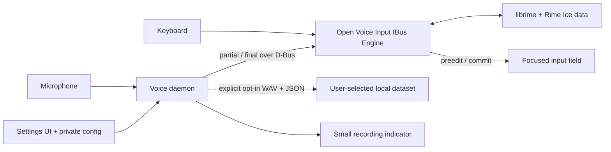

# Open Voice Input Linux

[简体中文快速上手](docs/README.zh-CN.md)

**A lightweight Linux/IBus voice-input preview with native caret-local preedit.**

Open Voice Input Linux 的目标是面向 Linux/IBus 的开源中文输入法：键盘输入
由 librime + 雾凇拼音负责，语音输入由火山引擎流式 ASR 负责。当前开发预览
已经让识别草稿直接显示在应用光标处，并在二遍识别完成后原位提交；键盘与
语音永久合并为同一个 librime 引擎仍是下一阶段。

Open Voice Input Linux is an early-stage Linux input method project. Its goal
is to keep the complete local Rime/Rime Ice typing experience while adding
native voice dictation directly inside the focused input field.

Canonical repository:
[github.com/SidUParis/openVoiceInput_linux](https://github.com/SidUParis/openVoiceInput_linux)

The voice path is faithful transcription, not generative writing: live ASR,
two-pass recognition, disfluency removal, punctuation, sentence segmentation,
and inverse text normalization. It does not turn a short instruction into an
email or otherwise invent content.

> **Current status:** the Python IBus inline-preedit prototype and a
> self-contained Volcengine voice daemon are implemented. During one recording
> they temporarily switch `current IBus engine → murmur-voice`, stream
> partial/final text over D-Bus, and, after an authoritative final, keep the
> same focused input context for a bounded five-second correction observation.
> They then restore the exact previous engine. Cancel, failure, or the next
> toggle ends the observation early; focus loss immediately invalidates
> learning. The daemon requests restoration before the evidence deadline;
> IBus command verification may finish shortly afterward. The
> optional per-user systemd installation now covers both processes. Before
> each dictation the daemon applies the user's microphone-category priority
> to the currently usable inputs for its own capture stream, and an explicit,
> default-off setting can retain accepted
> utterances as a local WAV/JSON dataset. The
> permanent combined Rime + voice engine and a distribution-native package are
> the next milestones.

## Why a new IBus engine?

The original Doubao Murmur desktop application did not own the active IBus input
context, so it needed a separate transcription window and clipboard-based
paste. The implemented Python prototype proves the replacement path by owning
an IBus context during dictation:

- ASR partial results use IBus preedit and appear at the caret.
- The optimized final result uses IBus commit and enters the application once.
- No black transcription window or synthetic paste is required.
- The target UI uses a small floating microphone button only for recording,
  finalizing, and error state. The standalone daemon currently exposes these
  states through its control command. The separately delivered compatibility
  Flatpak is a controller UI for that bounded interface; it does not contain
  this repository's microphone, provider, or dataset implementation.

The target combined architecture is:



## Repository components

- `engine/` — implemented Python `murmur-voice` prototype with dynamic IBus
  registration, focus-safe preedit/final commit, and a temporary D-Bus bridge.
  It will be replaced by the production `ibus-rime`/librime-capable engine.
- `voice/` — implemented, isolated Python daemon for microphone capture,
  Volcengine `bigmodel_async`, bounded local control, and the Preedit1 bridge.
- `settings/` — settings UI documentation and entry-point notes. The bounded
  GTK4 implementation lives in `voice/murmur_voice/settings_app.py` and
  `settings_controller.py`; it manages a masked API key, explicit vocabulary,
  recognition corrections, an optional local dataset destination, and
  user-service status/control through the daemon's private storage. Secret
  Service migration remains later work.
- `scripts/` — user install/uninstall helpers and a deterministic GTK preedit
  demonstration that does not use a microphone or network.
- `docs/` — architecture, security rules, prototype operation, and D-Bus
  contracts.

## 0.x compatibility ABI

The public project name and repository are **Open Voice Input Linux** and
`openVoiceInput_linux`. To avoid disrupting existing prototype installations
and the verified local sidecar bridge, the 0.x line intentionally retains
these historical internal identifiers:

- IBus engine `murmur-voice` and component `org.murmur.IME.Engine`;
- D-Bus bridge `org.murmur.IME.Preedit1` at
  `/org/murmur/IME/Preedit1`;
- executables `murmur-ime-engine` and `murmur-voice-daemon`, plus user units
  `murmur-ime-engine.service` and `murmur-ime-voice.service`;
- Python package `murmur_ime_engine`, text domain `murmur-ime`, and user data
  directory `$XDG_DATA_HOME/murmur-ime`.

These names are compatibility ABI, not public branding to replace
mechanically. Any future runtime-identifier migration must support existing
installations explicitly.

Rime Ice data is not currently vendored. Open Voice Input Linux will use
isolated system and user data directories; it will never concurrently write
the live database used by stock `ibus-rime`. Existing preferences and user
data will be imported only through an explicit migration flow. Release
packages must not download code or data during installation.

## What works now

- Native cumulative preedit at the active application caret.
- One authoritative `Final` committed exactly once, without clipboard paste.
- Bounded adaptive correction learning: after that commit, one strict
  replacement inside the committed span may become a private correction pair.
  Insertions, deletions, multiple edits, broad polishing, focus changes, and
  clients without IBus surrounding-text support do not learn.
- Focus token, D-Bus sender, utterance ID, and strictly increasing revision
  checks; stale results are rejected.
- Cancellation on focus loss, engine disable, or sidecar disappearance; an
  input-context reset also cancels before Final, while GTK's ordinary
  same-focus edit reset is tolerated during the bounded observation.
- Voice acquisition disabled for password, PIN, private, fake, and clients
  without preedit support.
- Runtime IBus registration without root access or an IBus/desktop restart.
- Self-contained microphone/Volcengine daemon with a 10-minute recording cap,
  a 10-second pending-audio cap, and generation-safe late callback rejection.
- Fresh microphone selection on every recording using a user-configurable
  order of DJI, headset, other external, and built-in categories. Unavailable
  categories fall through to the next one; link-aware DJI handling avoids a
  proven-offline receiver. Exact per-stream routing also works around a stale
  monitor default and can conservatively recover an output-only built-in card.
  This selection does not change playback or request a system-wide default
  change.
- Optional local dataset collection, disabled by default: an accepted
  authoritative provider final can publish the exact 16 kHz mono signed
  16-bit utterance as one WAV plus a versioned JSON record below a folder the
  user selected. Local writing is bounded and runs in the background.
- A private mode-0600 Unix control socket with `toggle`, `start`, `stop`,
  `cancel`, and `status` commands.
- Native GTK4 settings that never prefill the saved key and never restart a
  recording implicitly.

The temporary switch is a development bridge. While `murmur-voice` is active,
ordinary keys pass through and stock `ibus-rime` is not providing Chinese
keyboard composition. This includes the correction-observation window, which
ends after at most five seconds or on the next toggle. Ordinary direct key input
can still be handled by the application, but the previous Rime/IBus engine is
not available until it is restored. A true single input method still requires
the planned engine derived from `ibus-rime` and linked to librime.

Adaptive observation is enabled by default in this alpha after a
nonempty authoritative final. It is event-driven rather than a polling or
keyboard-monitoring loop, but the settings window does not yet provide a
disable switch. Applications without trustworthy IBus surrounding text simply
produce no learned pair.

Microphone choice is refreshed before every dictation. The settings window
stores one complete priority order for four categories: DJI, headset, other
external, and built-in. The recommended default is `DJI > headset > other
external > built-in`, but the user can reorder it. The daemon selects the
first currently usable category, preferring an explicitly remembered source,
then the system default within that category, then a unique candidate. An
ambiguous category is skipped rather than guessed.

DJI remains link-aware: a proven-online transmitter makes its receiver usable,
a proven-offline receiver is excluded, and an unknown link is not promoted
ahead of known-working alternatives. If that DJI source is the existing
system default and no verified non-DJI or recoverable input exists, it may be
kept as a last-resort continuity path. The choice is application-scoped: it
never changes a playback sink or requests a system-wide default-source change.
The source is fixed after the stream opens, so disconnecting a preferred
device during an utterance does not hand off live; the next dictation falls
through the saved order again.

## Try the prototype

Run the engine directly from the repository:

```bash
./engine/murmur-ime-engine
```

The deterministic visual demo and sender are documented in
[docs/prototype-demo.md](docs/prototype-demo.md). The complete runtime,
temporary bridge, safety, and optional per-user install instructions are in
[docs/python-preedit-prototype.md](docs/python-preedit-prototype.md).

For a zero-download, no-key smoke test that leaves the current desktop and
IBus engine untouched, run:

```bash
python3 -I scripts/run_isolated_preedit_smoke.py
```

It creates a temporary HOME plus private Xvfb, D-Bus and IBus instances,
sends fixed synthetic partial/final text, and retains private partial/final
screenshots at the printed path. This proves the real caret-local IBus path;
it does not test a microphone, provider account, systemd user session or fresh
operating-system dependencies.

To try the standalone daemon from source after installing the engine:

```bash
cd voice
python3 -m venv --system-site-packages .venv
PYTHONNOUSERSITE=1 .venv/bin/pip install -e '.[test]'
PYTHONNOUSERSITE=1 .venv/bin/murmur-voice-daemon configure
PYTHONNOUSERSITE=1 .venv/bin/murmur-voice-daemon run
```

The configuration prompt is masked and never accepts a key as a command-line
argument. Full daemon commands, permissions, limits, and dependencies are in
[voice/README.md](voice/README.md).

For a persistent per-user install from a connected source checkout, explicitly
opt into development dependency resolution:

```bash
./scripts/install-user.sh --allow-network
```

For a locked, no-network install, use the complete CI preview bundle described
below. Its `--wheelhouse` path is accepted only together with the matching
project wheel, runtime lock, SBOM, and hashes; an ad hoc `pip wheel` directory
is intentionally rejected.

After installation, open the native configuration window with:

```bash
~/.local/share/murmur-ime/open-voice-input-settings
```

The managed user install also adds an **Open Voice Input Linux** settings
launcher and project icon to the desktop application menu.


_Rendered from an empty temporary profile. The scrollable page continues to
explicit corrections, microphone selection, optional local collection, and
service controls._

Saving a key, microphone priority, or local-collection choice never contacts
the provider or interrupts a recording. Vocabulary, corrections, microphone
priority, and the collection choice are reloaded for the next dictation
without a service restart; microphone availability is also re-enumerated then.
Use the window's explicit enable/start action after configuration.

CI also publishes a clean-source Ubuntu x86_64 preview archive with a locked,
hashed Python wheelhouse, deterministic CycloneDX SBOM, and complete SHA-256
manifest. Its offline installation and verification procedure is documented in
[docs/offline-preview.md](docs/offline-preview.md).

User-visible preview changes and known limitations are tracked in
[CHANGELOG.md](CHANGELOG.md).

Configuration, systemd behavior, upgrades, desktop shortcuts, troubleshooting,
and safe uninstall are documented in
[docs/user-service.md](docs/user-service.md). This is still a developer
preview: there is not yet a distribution-native package or built-in global
shortcut.

IBus preedit is session-local and cannot be forwarded through an RDP canvas as
ordinary keystrokes. Remmina microphone redirection, remote-session setup, and
the explicit clipboard fallback are documented in
[docs/remote-desktop.md](docs/remote-desktop.md).

Run the current offline test suites with:

```bash
PYTHONPATH=engine python3 -m unittest discover -s engine/tests -v
PYTHONPATH=voice python3 -m pytest -q -p no:cacheprovider voice/tests
```

The current tree contains separate engine, installer/service, and voice-daemon
test suites. They use protocol fixtures and fake audio/D-Bus/systemd/IBus
boundaries; they do not call a real microphone, editable IBus context, package
index, or cloud account.

## Target MVP behavior

1. Select **Open Voice Input Linux** as the active IBus engine.
2. Type normally with Rime/Rime Ice, fully offline.
3. Press the configured shortcut (right `Alt` where available) or the
   microphone button to start dictation.
4. See live hypotheses at the current caret as IBus preedit.
5. Stop recording; the two-pass, smoothed result replaces the hypothesis and
   is committed exactly once.
6. For at most five seconds, correct one wrong span in the same input field.
   When IBus surrounding text is supported, that strict replacement can become
   an adaptive correction for the next dictation. Another toggle ends this
   observation early.
7. Press `Esc` or change focus to cancel without committing late results;
   losing focus during observation prevents learning.

Voice input will be disabled for password/private input contexts. An active
Rime composition must be committed or cancelled before voice recording starts.

## Provider scope

The first provider is Volcengine BigModel ASR 2.0 using
`bigmodel_async`, `enable_nonstream`, `enable_ddc`, `enable_itn`, and
`enable_punc`. After the user activates the matching speech service in their
own Volcengine project, the application needs only that user's API key. No
shared key is bundled. Provider interfaces remain separate from the IBus
engine so additional ASR services can be added later.

Microphone audio is streamed to Volcengine only during an active dictation and
usage is billed to the user's own Volcengine account. Cancelling prevents a
local commit but cannot retract audio already uploaded. If the user separately
enables local collection, the same accepted utterance is also retained below
the selected local or mounted folder; this does not replace or alter the
provider upload. Read
[docs/privacy.md](docs/privacy.md) before using voice input with sensitive
data. The reviewed security assumptions and accepted preview risks are in the
[threat model](docs/threat-model.md); bundled-code and dependency attribution
is recorded in the [licence audit](docs/license-audit.md) and
[NOTICE](NOTICE.md). Maintainers should follow the
[release process](docs/release-process.md) before publishing a preview.

The correction strategy is documented in
[docs/recognition-accuracy.md](docs/recognition-accuracy.md): provider-side
two-pass recognition first, then the explicit private vocabulary for names and
specialist terms, with optional user-confirmed wrong-to-canonical mappings sent
through Volcengine's documented `context.correct_words`. A bounded five-second
IBus surrounding-text observation can also derive one strict replacement into
the private `adaptive-corrections.json` ledger. It never rewrites the already
committed text or reads the clipboard, AT-SPI, global keystrokes, or Rime
database. The bounded current-field surrounding snapshot is used transiently
and is not retained as a document or transcript record. Manual corrections take
priority; conflicted, overlapping, or cyclic learned rules are suppressed, and
the combined provider view remains at most 50 pairs. Configuration is reloaded
for the next dictation without restarting the daemon. This is correction
memory, not local model training.

The optional personal-ASR collector is implemented but **off by default**. The
user must choose an existing absolute local or mounted folder; the application
initializes `openvoiceinput-dataset-v1` below it. Only an utterance whose
authoritative provider final was accepted is published, as the exact 16 kHz
mono signed 16-bit WAV plus `record.json`. `provider_final` is explicitly an
unreviewed pseudo-label; `spoken_verbatim` and `preferred_output` remain null
until a later review workflow. The collector uses bounded memory and a
background writer, and collection failures do not block normal dictation.
It writes directly to that folder with no fallback spool; service shutdown
allows a bounded 10-second drain, so a stalled or unmounted destination can
lose an unpublished staged record while published records remain.

This feature does not upload the local dataset, transfer it to Orange, train or
fine-tune a model, or add application-level encryption. The selected
filesystem determines the effective visibility and at-rest protection.
Disabling collection prevents queued unpublished records from becoming
visible; records already published remain until the user removes them. See
[docs/personal-asr-data-plan.md](docs/personal-asr-data-plan.md).

## Development targets

- Validated preview and offline-bundle target: Ubuntu 24.04 x86_64 with IBus
- Planned, currently unverified development target: Ubuntu 26.04 with IBus
- X11 and Wayland applications that implement IBus preedit correctly
- Debian package first; Arch packaging afterwards

See [ROADMAP.md](ROADMAP.md) and [docs/architecture.md](docs/architecture.md).

## License and upstream projects

Open Voice Input Linux's new original code is licensed under GPL-3.0-only. It
is designed around `ibus-rime` (GPL-3.0-or-later) and `librime`
(BSD-3-Clause). Rime Ice is currently an external GPL-3.0-only project and is
not bundled in this repository. Imported files retain their upstream license
and copyright notices; voice-daemon code migrated from Doubao Murmur must
preserve its MIT notices.

See [NOTICE.md](NOTICE.md) for attribution and distribution boundaries and
[docs/dependencies.md](docs/dependencies.md) for the direct dependency and
licence inventory.

Open Voice Input Linux is an independent community project and is not
affiliated with Rime, Volcengine, ByteDance, or Doubao.
