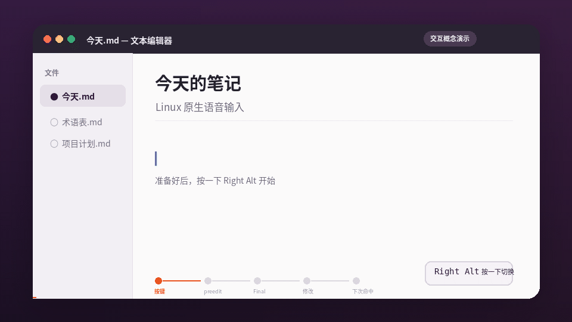
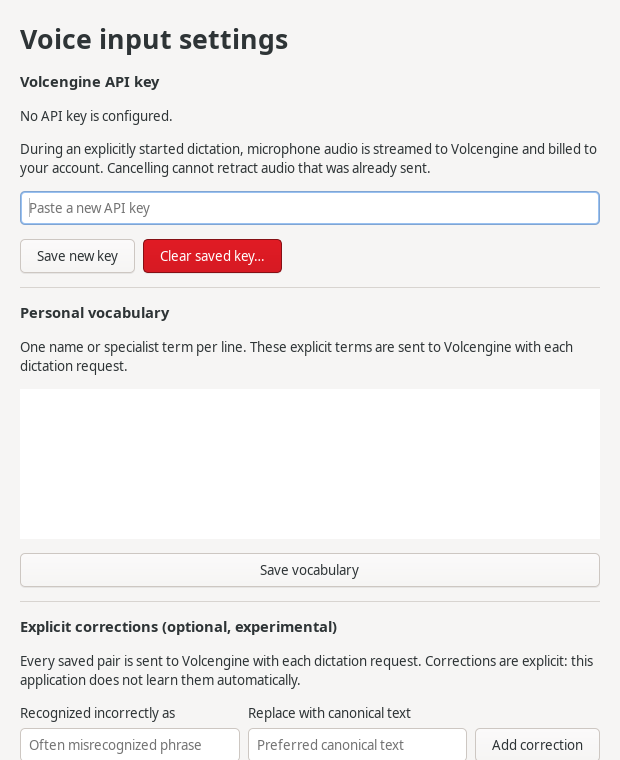
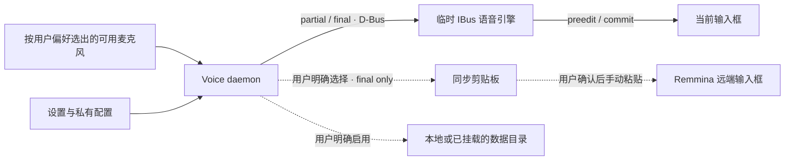

<div align="center">
  
  <h1>Open Voice Input Linux</h1>
  <p><strong>Linux 原生自适应语音输入：说话，文字直接出现在当前光标。</strong></p>
  <p>面向 Ubuntu、IBus 和中文输入场景；默认直接进入当前光标，远程桌面可明确选择
  只复制终稿，再由用户手动粘贴。</p>
  <p><strong>简体中文</strong> · <a href="README.en.md">English</a></p>
  <p>
    <a href="https://github.com/SidUParis/openVoiceInput_linux/actions/workflows/ci.yml"></a>
    <a href="https://github.com/SidUParis/openVoiceInput_linux/releases"></a>
    <a href="LICENSE"></a>
  </p>
  <strong>光标内出字</strong> · <strong>远程复制默认关闭</strong> ·
  <strong>.deb 约 404 KiB</strong> · <strong>数据采集默认关闭</strong>
</div>



_这是使用合成文字制作的交互概念动画，用来说明已经实现的 IBus 光标内
preedit/commit 流程；它不是实际录屏，也没有调用麦克风、API Key 或网络。_

> [!IMPORTANT]
> 当前是面向 **Ubuntu 24.04 x86_64 + IBus** 的公开 alpha。真实听写使用
> 用户选择的在线 ASR 账户并产生相应费用；火山引擎是默认且已实机验证的路径，
> Qwen 与 OpenAI 是尚未用真实 Key 验收的实验后端。本项目目前没有本地 ASR，
> 也不会自动注册系统级快捷键。

## 一分钟安装

从 [v0.1.0-alpha.7 Release](https://github.com/SidUParis/openVoiceInput_linux/releases/tag/v0.1.0-alpha.7)
下载 `.deb`，然后在下载目录运行：

```bash
sudo apt install ./open-voice-input-linux_*_amd64.deb
```

安装完成后，从应用菜单打开 **Open Voice Input Linux**，或运行：

```bash
open-voice-input-settings
```



_截图由当前 `main` 分支使用空临时配置渲染，不包含已经保存的 Key 或用户数据。_

接下来只需：

1. 选择识别服务，并填入这个服务的 API Key；
2. 按自己的设备和使用场景设置麦克风优先级；
3. 点击 **启用并启动**；
4. 在 GNOME/KDE 键盘快捷键设置中，选择一个方便且不冲突的组合键并绑定到：

```bash
murmur-voice-daemon toggle
```

第一次触发开始听写，第二次触发停止录音并等待二遍识别结果。

设置页还可以切换为“按住说话”。这个模式使用两个明确事件：按下时调用
`murmur-voice-daemon press`，松开时调用 `murmur-voice-daemon release`；过短
按压会取消，重复 key-down 不会重复开麦，松开事件丢失时会在用户设置的上限
自动停止。项目不指定 Right Alt 或任何其他物理键。普通 GNOME/KDE 快捷键
通常只提供一次 activation，适合上面的 `toggle`；按住说话只有在桌面、键盘
或辅助工具能够分别发出 press/release 时才可用。通用 Wayland 快捷键没有
可靠的全局松开事件，本项目不会宣称已经绕过这个限制，也不会扫描全部
`/dev/input`。

## 为什么它不只是另一个语音转写窗口

| 能力 | Open Voice Input Linux 的做法 |
| --- | --- |
| 光标内实时出字 | 使用 IBus preedit 在当前输入框显示 partial，authoritative final 原位提交且只提交一次 |
| 不依赖粘贴 | 默认路径不读取或写入剪贴板，不发送 `Ctrl+V`，不模拟逐字键盘输入 |
| 远程桌面兼容 | 可明确选择只复制 authoritative final，再由用户在 Remmina 远端确认位置并手动粘贴；默认关闭 |
| 忠实/清爽终稿 | partial 始终原样；终稿可原样提交，或仅用本机有界删除规则清理高置信口头停顿与重复 |
| 记住个人术语 | 在同一输入框内最多观察 5 秒；明确单项可启用，多处修改拆成待确认候选，并提供显式整句 fallback |
| 动态麦克风 | 每次听写按用户保存的顺序重新选择当前可用输入；首选设备不可用时，下一次自动回退 |
| 数据归用户 | 可选保存 WAV 与版本化 JSON 到用户选择的本地或已挂载目录，采集默认关闭 |
| 轻量安装 | 当前 `.deb` 约 404 KiB，包自身安装占用约 2.7 MiB，不捆绑本地 ASR 模型 |

### 1. 文字真正进入当前输入框

支持实时 partial 的服务会把累计草稿直接显示在当前光标；所选服务返回
authoritative final 后，输入法只提交一次。OpenAI 批量后端只在停录后返回
final，不伪装成实时流。你不需要先去转写窗口复制，再切回原应用粘贴。

### 2. 从精确修改中学习

最终文本提交后，输入法可以在同一输入框中保留最长 5 秒的有界观察窗口。
单一高置信术语或拼写修正可以立即启用；多处独立替换会拆成候选，冲突项会
隔离，只有确认后才进入后续听写。设置页会显示最近一次为什么“已启用、待确认、
冲突或跳过”。Chrome 与 Electron 等无法提供可信 surrounding text 的应用可以使用
`open-voice-input-settings --review-last`：守护进程只在内存中保留最近一条已接受的
识别结果十分钟，设置页以只读方式载入原文，用户明确把副本改成实际说出的逐字
内容后才学习。例如把 `bench mark` 修成 `benchmark` 时，只形成这个短语的规则，
不会把整句一起记住。

“云端识别”页可选择 **忠实转写**（默认）或 **清爽表达**。模式在每条听写开始
时冻结；实时 partial 不清理，只有 authoritative final 才运行本机确定性删除规则。
清理不调用 LLM，也不增加网络请求，不替换术语、数字或大小写；失败、超限、
不可重放或会删除全部内容时直接交付原始 final。若清理确实改变文本，本条会跳过
自动学习观察，避免把机器删词当作 ASR 纠错；显式复核始终以原始 provider final
为来源，实际交付文本只读展示。

提交时设置页只把最近结果 ID 与逐字复核送回独立的主机私有 socket；守护进程
再次核对该 ID 仍是当前未过期结果，再以同一个 ID 更新学习账本，并在数据留存
已启用时把有界纠错结果排入对应 WAV 的 `feedback/` sidecar。成功后该结果立即
消费，重复提交、过期结果和被新听写替换的旧窗口都会被拒绝。界面会区分
“未启用数据留存”“已进入后台队列”和“反馈未能入队”，不会把入队称为最终落盘。

自动学习不会监听全局键盘、AT-SPI、剪贴板、Rime 历史或其他应用内容，也不会把完整
surrounding text 写进纠错账本。失焦、超时和整句润色不会被静默提升为全局规则；
去口头词或表达润色也不能填写成 `spoken_verbatim`。

### 3. 可选保留个人 ASR 数据

采集默认关闭。明确启用后，一次 authoritative final 成功交付到该条冻结的目标
（当前光标或显式剪贴板）后，可以保存为：

- 精确的 16 kHz 单声道 WAV；
- 版本化 `record.json`；
- 麦克风类别、选择依据与实际 Pulse 路由变化（不保存设备私密名称或序列号）；
- 后台事后计算的整体/首秒削波、RMS、峰值、直流偏移与零值比例（只记录数值，
  不拦截、不延迟、不修改录音）；
- 数据集根目录下不含转写正文、只供首页汇总的
  `usage/<utterance_id>.json`；
- 数据集根目录下 append-only 的
  `feedback/<utterance_id>/<event_id>.json` 纠错决定（只有捕获成功时）；
- 未经人工审核的供应商 final。
- 实际交付到冻结目标的 `delivery`（机器生成、未经复核），以及可从原始 final 重放的删除
  位置、原因和原片段；`provider_final` 仍单独保留。

新记录使用 schema v4，并在 `delivery.target` 标明 `caret` 或 `clipboard`；旧
v1/v2/v3 不会改写。usage 索引使用 schema v2，并明确按
实际交付文本统计字数，同时继续读取旧 v1 摘要。后续修改不会改写不可变的 `record.json`；可捕获的短纠错作为独立 feedback
事件保存。`spoken_verbatim` 与 `preferred_output` 仍待未来听音审核流程填写，
因此这些是有价值的候选数据，不是已经确认的 gold label。

首页只在后台读取 `usage/<utterance_id>.json` 来显示今日字数、录音时长、听写次数和累计
统计，不会打开或展示 `record.json` 中的转写正文。数据留存关闭时不会扫描
旧目录；远程挂载断线时会显示“存储不可用”，而不是把未知状态当成 0。

目录可以位于本地磁盘，也可以是操作系统已经挂载的 SSHFS 等 POSIX
文件系统。程序本身不会登录远端，也不直接接受 Google Drive URL。Google
Drive 更适合在一条记录完整发布后使用 `rclone copy` 异步备份。详见
[远程数据集存储指南](docs/remote-dataset-storage.md)。

### 4. 小安装包，不把模型塞进电脑

当前 alpha.4 的正式 Debian 包是 **413,736 字节（约 404 KiB）**，包元数据中
的 `Installed-Size` 是 **2,776 KiB（约 2.7 MiB）**。它复用 Ubuntu 已有的
Python、GTK、IBus 与音频组件，不随包附带几百兆的模型权重，也不会在首次
启动时偷偷下载模型。

这是“轻量客户端”的含义，并不等于完全离线：当前识别仍由用户选择并配置的
在线 ASR 服务完成。若一台全新 Ubuntu 机器尚未安装所需系统组件，APT 可能
额外下载依赖；具体总下载量取决于机器现状。

## 在线服务、隐私与费用

**火山引擎 BigModel ASR 2.0**仍是默认且已经在维护者机器上实机使用的后端。
alpha.5 还接入了 Qwen 实时 ASR 与 OpenAI 停录后 Transcribe；两者通过完整的
假传输协议测试，但尚未用真实用户 Key 验收。MiniMax 只显示为计划项，因为目前
没有找到可独立验证的官方语音转文字接口，项目不会伪造一个适配器。所有后端都
需要用户自己的账户、Key 与费用；保存设置本身不会联系供应商。详见
[后端说明](docs/provider-backends.md)。

只有用户主动开始听写后，音频才会发给当前选择的在线 ASR 服务。取消可以阻止
本地提交，但无法撤回已经上传的音频；计费、地域处理与服务端留存遵循用户所选
服务及其账户配置。可选 WAV/JSON 采集是另一项独立 opt-in，不会替代供应商
上传，也不会由本项目再次上传到其他服务。

语音路径负责转写，不是生成式写作。供应商侧 DDC、标点、分句和 ITN 可以
整理文本，但程序不会把一句短指令扩写成邮件，也不会主动补充用户没有说的
事实。使用敏感内容前请阅读[隐私说明](docs/privacy.md)和
[威胁模型](docs/threat-model.md)。

## 当前支持范围

| 项目 | 当前 alpha 状态 |
| --- | --- |
| 操作系统 | Ubuntu 24.04 x86_64 是 `.deb` 与 CI 的明确目标 |
| 桌面输入 | 面向支持标准 IBus preedit 的应用；X11/Wayland 真实应用矩阵仍在扩大 |
| 中文键盘 | 听写时临时切换到 `murmur-voice`，结束后恢复原来的精确 IBus 引擎；librime／雾凇永久合并尚未完成 |
| ASR | 火山引擎默认；Qwen 实时与 OpenAI 批量为未用真实 Key 验收的实验后端；均需用户自己的账户与 Key |
| 本地 ASR | 尚未实现，Whisper/Qwen 等个人模型属于后续路线 |
| 快捷键 | 设置可选点按切换或按住说话；按键由用户选择，Wayland 的全局 release 边界会如实显示 |
| 密码与隐私输入框 | password、PIN、private、fake 或不支持 preedit 的上下文拒绝开始语音 |
| 远程桌面 | IBus preedit 不能穿过 RDP 画布；可显式启用终稿复制，由用户在远端手动 `Ctrl+V`，无 partial、自动粘贴或 surrounding-text 学习 |

这是社区测试用的公开 alpha，不是稳定发行版。请同时查看
[CHANGELOG](CHANGELOG.md)、[ROADMAP](ROADMAP.md)和
[真实兼容性验证矩阵](docs/compatibility-matrix.md)。

## 日常使用

默认只需要一个由用户自己选择的快捷键：第一次触发开始听写，第二次触发
停止并等待 final。也可在设置页选择按住说话，并接入分别发送 press/release
的按键工具。设置页负责 Key、交互模式、个人词表、纠错、设备偏好与可选数据
采集；保存设置不会打断正在进行的听写，新配置从下一次听写开始生效。
个人词表与明确纠错是两份可选的手动配置，只有点击保存才会建立对应文件；
自动学习使用独立的私有账本。设置页会分别显示这三类来源，以及下一次请求
实际会带上的纠错上下文数量，避免把“文件不存在”误解为“学习没有运行”。

Remmina 等 RDP 画布不是本机 IBus 输入框。需要把本机识别结果交给远端时，可在
**远程桌面**页显式选择“同步剪贴板”。它只复制确认后的终稿，不复制 partial、
不自动粘贴，也不会发送模拟按键；状态只证明上一条写入当时成功，其他应用可能
随后覆盖剪贴板。由用户确认远端光标并手动 `Ctrl+V`。内容会同时暴露给本机和远程会话的剪贴板，禁止用于密码、Key、验证码
等秘密；该条也不会尝试 surrounding-text 自动学习。详见
[远程桌面输入](docs/remote-desktop.md)。

麦克风顺序完全由用户设置。每次新听写都会重新检查当前可用输入，并按照该
顺序选择；首选设备掉线时自动尝试后续候选，重新连接后也无需重启服务。选择
只作用于本应用新开的录音流，不主动修改播放设备、系统默认输入、音量或
静音；一次已经开始的听写不会在中途换麦。

<details>
<summary>命令行控制（可选）</summary>

<br>

```bash
murmur-voice-daemon start    # 开始
murmur-voice-daemon stop     # 停止并等待 final
murmur-voice-daemon press    # 按键按下（按设置决定 toggle / push-to-talk）
murmur-voice-daemon release  # 按键松开
murmur-voice-daemon cancel   # 取消本地提交
murmur-voice-daemon status   # 查看状态
```

</details>

## 架构与安全边界



网络侧语音守护进程与 IBus engine 分离。焦点 token、D-Bus sender、utterance
ID 和单调 revision 共同拒绝迟到或串会话结果；密码、PIN、private、fake 与
不支持 preedit 的上下文在开麦前拒绝。

当前听写与短暂纠错窗口会临时占用 `murmur-voice`，随后恢复原来的 IBus
engine。生产目标仍是一个 librime-capable engine，让键盘与语音连续共存。

## 不用 Key 的确定性演示

开发者可以在不使用麦克风、API Key、网络，也不修改当前桌面 IBus 的情况下
验证真实 preedit/commit 路径：

```bash
python3 -I scripts/run_isolated_preedit_smoke.py
```

它使用私有 Xvfb、D-Bus 和 IBus 实例发送固定的合成中文 partial/final。
这能验证光标内协议路径，但不能证明真实麦克风质量、供应商准确率或所有应用
兼容性。

## 卸载

```bash
sudo apt remove open-voice-input-linux
```

卸载会保留用户自己的 API Key 配置、词表、纠错、麦克风策略、采集选择和
外部 dataset；只有用户明确操作时才应删除这些私人数据。

## 文档与参与

- [完整中文安装与使用指南](docs/README.zh-CN.md)
- [English README](README.en.md)
- [架构](docs/architecture.md)与 [D-Bus 接口](docs/dbus-api.md)
- [识别准确率与自适应纠错](docs/recognition-accuracy.md)
- [个人 ASR 数据计划](docs/personal-asr-data-plan.md)
- [远程与已挂载存储](docs/remote-dataset-storage.md)
- [安全说明](docs/security.md)、[威胁模型](docs/threat-model.md)与[隐私说明](docs/privacy.md)
- [发布定位与演示分镜](docs/launch-positioning.md)
- [中文产品发布计划](docs/product-launch-plan.zh-CN.md)
- [中文宣传资料包](docs/press-kit.zh-CN.md)
- [贡献指南](CONTRIBUTING.md)与[支持渠道](SUPPORT.md)

欢迎提交真实的发行版、桌面、应用和麦克风兼容性报告，但请不要在 issue、
截图或日志中上传 API Key、私人录音、真实转写、个人词表或数据集路径。

## 许可证

新原创代码采用 GPL-3.0-only。项目围绕 `ibus-rime`（GPL-3.0-or-later）和
`librime`（BSD-3-Clause）设计；雾凇拼音是外部 GPL-3.0-only 项目，不随本
仓库打包。详见 [NOTICE](NOTICE.md) 与[许可证审计](docs/license-audit.md)。

Open Voice Input Linux 是独立社区项目，与 Rime、火山引擎、字节跳动或豆包
不存在隶属或官方合作关系。
