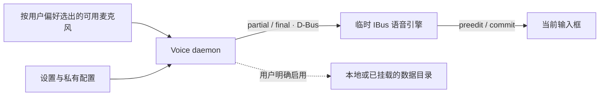

<div align="center">
  
  <h1>Open Voice Input Linux</h1>
  <p><strong>Linux 原生自适应语音输入：说话，文字直接出现在当前光标。</strong></p>
  <p>面向 Ubuntu、IBus 和中文输入场景；不读取剪贴板，不发送 <code>Ctrl+V</code>，
  也不靠模拟逐字按键完成输入。</p>
  <p><strong>简体中文</strong> · <a href="README.en.md">English</a></p>
  <p>
    <a href="https://github.com/SidUParis/openVoiceInput_linux/actions/workflows/ci.yml"></a>
    <a href="https://github.com/SidUParis/openVoiceInput_linux/releases"></a>
    <a href="LICENSE"></a>
  </p>
  <strong>光标内出字</strong> · <strong>不碰剪贴板</strong> ·
  <strong>.deb 约 404 KiB</strong> · <strong>数据采集默认关闭</strong>
</div>


_这是使用合成文字制作的交互概念动画，用来说明已经实现的 IBus 光标内
preedit/commit 流程；它不是实际录屏，也没有调用麦克风、API Key 或网络。_

> [!IMPORTANT]
> 当前是面向 **Ubuntu 24.04 x86_64 + IBus** 的公开 alpha。真实听写使用
> 用户自己的火山引擎账户并产生相应费用；本项目目前没有本地 ASR，也不会
> 自动注册系统级快捷键。

## 一分钟安装

从 [v0.1.0-alpha.4 Release](https://github.com/SidUParis/openVoiceInput_linux/releases/tag/v0.1.0-alpha.4)
下载 `.deb`，然后在下载目录运行：

```bash
sudo apt install ./open-voice-input-linux_*_amd64.deb
```

安装完成后，从应用菜单打开 **Open Voice Input Linux**，或运行：

```bash
open-voice-input-settings
```


_截图由当前 `main` 分支使用空临时配置渲染，不包含已经保存的 Key 或用户数据。_

接下来只需：

1. 填入自己的火山引擎 API Key；
2. 按自己的设备和使用场景设置麦克风优先级；
3. 点击 **启用并启动**；
4. 在 GNOME/KDE 键盘快捷键设置中，选择一个方便且不冲突的组合键并绑定到：

```bash
murmur-voice-daemon toggle
```

第一次触发开始听写，第二次触发停止录音并等待二遍识别结果。

## 为什么它不只是另一个语音转写窗口

| 能力 | Open Voice Input Linux 的做法 |
| --- | --- |
| 光标内实时出字 | 使用 IBus preedit 在当前输入框显示 partial，authoritative final 原位提交且只提交一次 |
| 不依赖粘贴 | 正常路径不读取剪贴板，不发送 `Ctrl+V`，不模拟逐字键盘输入 |
| 记住个人术语 | 在同一输入框内最多观察 5 秒，只从一次严格替换中提取有界的“错误 → 正确”规则 |
| 动态麦克风 | 每次听写按用户保存的顺序重新选择当前可用输入；首选设备不可用时，下一次自动回退 |
| 数据归用户 | 可选保存 WAV 与版本化 JSON 到用户选择的本地或已挂载目录，采集默认关闭 |
| 轻量安装 | 当前 `.deb` 约 404 KiB，包自身安装占用约 2.7 MiB，不捆绑本地 ASR 模型 |

### 1. 文字真正进入当前输入框

火山引擎返回的累计草稿直接显示在当前光标；二遍结果到达后，输入法只提交
一个 final。你不需要先去转写窗口复制，再切回原应用粘贴。

### 2. 从精确修改中学习

最终文本提交后，输入法可以在同一输入框中保留最长 5 秒的有界观察窗口。
如果用户只替换了原提交区间内的一处文字，这个严格的纠错对可以用于后续
听写。例如把 `bench mark` 修成 `benchmark` 时，只会形成这一个具体短语的
候选规则，不会把无关的单词或整句一起记住。

它不会监听全局键盘、AT-SPI、剪贴板、Rime 历史或其他应用内容。失焦、
超时、多处修改、整句润色以及不支持可信 IBus surrounding text 的应用都
不会学习。

### 3. 可选保留个人 ASR 数据

采集默认关闭。明确启用后，一次被当前 IBus 上下文接受的听写可以保存为：

- 精确的 16 kHz 单声道 WAV；
- 版本化 `record.json`；
- 未经人工审核的供应商 final。

当前用户后续修改**还不会回填**已有训练 JSON，`spoken_verbatim` 与
`preferred_output` 也仍待未来的审核流程填写。因此这些是有价值的候选数据，
不是已经确认的 gold label。

目录可以位于本地磁盘，也可以是操作系统已经挂载的 SSHFS 等 POSIX
文件系统。程序本身不会登录远端，也不直接接受 Google Drive URL。Google
Drive 更适合在一条记录完整发布后使用 `rclone copy` 异步备份。详见
[远程数据集存储指南](docs/remote-dataset-storage.md)。

### 4. 小安装包，不把模型塞进电脑

当前 alpha.4 的正式 Debian 包是 **413,736 字节（约 404 KiB）**，包元数据中
的 `Installed-Size` 是 **2,776 KiB（约 2.7 MiB）**。它复用 Ubuntu 已有的
Python、GTK、IBus 与音频组件，不随包附带几百兆的模型权重，也不会在首次
启动时偷偷下载模型。

这是“轻量客户端”的含义，并不等于完全离线：当前识别仍由用户选择并配置的
在线 ASR 服务完成。若一台全新 Ubuntu 机器尚未安装所需系统组件，APT 可能
额外下载依赖；具体总下载量取决于机器现状。

## 在线服务、隐私与费用

当前唯一实现的 ASR 后端是**火山引擎 BigModel ASR 2.0**，需要用户自己开通
服务、提供 API Key 并承担账户费用。项目不内置共享 Key，也不会在保存设置时
联系供应商。

只有用户主动开始听写后，音频才会发给火山引擎。取消可以阻止本地提交，但
无法撤回已经上传的音频。可选 WAV/JSON 采集是另一项独立 opt-in，不会替代
供应商上传，也不会由本项目再次上传到其他服务。

语音路径负责转写，不是生成式写作。供应商侧 DDC、标点、分句和 ITN 可以
整理文本，但程序不会把一句短指令扩写成邮件，也不会主动补充用户没有说的
事实。使用敏感内容前请阅读[隐私说明](docs/privacy.md)和
[威胁模型](docs/threat-model.md)。

## 当前支持范围

| 项目 | 当前 alpha 状态 |
| --- | --- |
| 操作系统 | Ubuntu 24.04 x86_64 是 `.deb` 与 CI 的明确目标 |
| 桌面输入 | 面向支持标准 IBus preedit 的应用；X11/Wayland 真实应用矩阵仍在扩大 |
| 中文键盘 | 听写时临时切换到 `murmur-voice`，结束后恢复原来的精确 IBus 引擎；librime／雾凇永久合并尚未完成 |
| ASR | 目前只有火山引擎在线服务，需要用户自己的 Key |
| 本地 ASR | 尚未实现，Whisper/Qwen 等个人模型属于后续路线 |
| 快捷键 | 当前需要用户自行绑定 `murmur-voice-daemon toggle` |
| 密码与隐私输入框 | password、PIN、private、fake 或不支持 preedit 的上下文拒绝开始语音 |
| 远程桌面 | IBus preedit 不能作为普通按键穿过 RDP 画布 |

这是社区测试用的公开 alpha，不是稳定发行版。请同时查看
[CHANGELOG](CHANGELOG.md)、[ROADMAP](ROADMAP.md)和
[真实兼容性验证矩阵](docs/compatibility-matrix.md)。

## 日常使用

日常使用只需要一个由用户自己选择的快捷键：第一次触发开始听写，第二次
触发停止并等待 final。设置页负责 Key、个人词表、纠错、设备偏好与可选数据
采集；保存设置不会打断正在进行的听写，新配置从下一次听写开始生效。

麦克风顺序完全由用户设置。每次新听写都会重新检查当前可用输入，并按照该
顺序选择；首选设备掉线时自动尝试后续候选，重新连接后也无需重启服务。选择
只作用于本应用新开的录音流，不主动修改播放设备、系统默认输入、音量或
静音；一次已经开始的听写不会在中途换麦。

<details>
<summary>命令行控制（可选）</summary>

<br>

```bash
murmur-voice-daemon start    # 开始
murmur-voice-daemon stop     # 停止并等待 final
murmur-voice-daemon cancel   # 取消本地提交
murmur-voice-daemon status   # 查看状态
```

</details>

## 架构与安全边界



网络侧语音守护进程与 IBus engine 分离。焦点 token、D-Bus sender、utterance
ID 和单调 revision 共同拒绝迟到或串会话结果；密码、PIN、private、fake 与
不支持 preedit 的上下文在开麦前拒绝。

当前听写与短暂纠错窗口会临时占用 `murmur-voice`，随后恢复原来的 IBus
engine。生产目标仍是一个 librime-capable engine，让键盘与语音连续共存。

## 不用 Key 的确定性演示

开发者可以在不使用麦克风、API Key、网络，也不修改当前桌面 IBus 的情况下
验证真实 preedit/commit 路径：

```bash
python3 -I scripts/run_isolated_preedit_smoke.py
```

它使用私有 Xvfb、D-Bus 和 IBus 实例发送固定的合成中文 partial/final。
这能验证光标内协议路径，但不能证明真实麦克风质量、供应商准确率或所有应用
兼容性。

## 卸载

```bash
sudo apt remove open-voice-input-linux
```

卸载会保留用户自己的 API Key 配置、词表、纠错、麦克风策略、采集选择和
外部 dataset；只有用户明确操作时才应删除这些私人数据。

## 文档与参与

- [完整中文安装与使用指南](docs/README.zh-CN.md)
- [English README](README.en.md)
- [架构](docs/architecture.md)与 [D-Bus 接口](docs/dbus-api.md)
- [识别准确率与自适应纠错](docs/recognition-accuracy.md)
- [个人 ASR 数据计划](docs/personal-asr-data-plan.md)
- [远程与已挂载存储](docs/remote-dataset-storage.md)
- [安全说明](docs/security.md)、[威胁模型](docs/threat-model.md)与[隐私说明](docs/privacy.md)
- [发布定位与演示分镜](docs/launch-positioning.md)
- [中文产品发布计划](docs/product-launch-plan.zh-CN.md)
- [中文宣传资料包](docs/press-kit.zh-CN.md)
- [贡献指南](CONTRIBUTING.md)与[支持渠道](SUPPORT.md)

欢迎提交真实的发行版、桌面、应用和麦克风兼容性报告，但请不要在 issue、
截图或日志中上传 API Key、私人录音、真实转写、个人词表或数据集路径。

## 许可证

新原创代码采用 GPL-3.0-only。项目围绕 `ibus-rime`（GPL-3.0-or-later）和
`librime`（BSD-3-Clause）设计；雾凇拼音是外部 GPL-3.0-only 项目，不随本
仓库打包。详见 [NOTICE](NOTICE.md) 与[许可证审计](docs/license-audit.md)。

Open Voice Input Linux 是独立社区项目，与 Rime、火山引擎、字节跳动或豆包
不存在隶属或官方合作关系。
