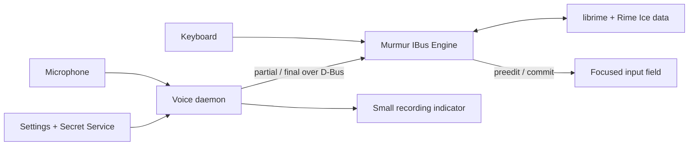

# Murmur IME

**Rime Ice keyboard input + Volcengine voice dictation, presented as one Linux IBus engine.**

Murmur IME 是面向 Linux/IBus 的开源中文输入法：键盘输入由
librime + 雾凇拼音负责，语音输入由火山引擎流式 ASR 负责。识别草稿
直接显示在当前应用的输入位置，二遍识别完成后原位提交。

Murmur IME is an early-stage Linux input method project. Its goal is to keep
the complete local Rime/Rime Ice typing experience while adding native voice
dictation directly inside the focused input field.

The voice path is faithful transcription, not generative writing: live ASR,
two-pass recognition, disfluency removal, punctuation, sentence segmentation,
and inverse text normalization. It does not turn a short instruction into an
email or otherwise invent content.

> Status: architecture and repository scaffold. The existing Murmur sidecar
> remains the working prototype while the IBus engine is built.

## Why a new IBus engine?

The current Murmur prototype is a normal desktop application. It does not own
the active IBus input context, so it needs a separate black transcription
window and clipboard-based paste. Murmur IME will own that input context:

- ASR partial results use IBus preedit and appear at the caret.
- The optimized final result uses IBus commit and enters the application once.
- No black transcription window is required.
- A small floating microphone button only shows recording, finalizing, and
  error state.

## Planned components

- `engine/` — GPL IBus engine based on `ibus-rime`, responsible only for
  keyboard input, focus ownership, preedit, and commit.
- `voice/` — isolated Python daemon for microphone capture and Volcengine
  streaming ASR. Network latency must never block keyboard input.
- `settings/` — GTK settings application for provider configuration and a
  masked API key stored through Secret Service.
- `docs/` — architecture, privacy/security rules, and the D-Bus contract.

Rime Ice data is not currently vendored. Murmur IME will use isolated system
and user data directories; it will never concurrently write the live database
used by stock `ibus-rime`. Existing preferences and user data will be imported
only through an explicit migration flow. Release packages must not download
code or data during installation.

## MVP behavior

1. Select **Murmur IME** as the active IBus engine.
2. Type normally with Rime/Rime Ice, fully offline.
3. Press the configured shortcut (right `Alt` where available) or the
   microphone button to start dictation.
4. See live hypotheses at the current caret as IBus preedit.
5. Stop recording; the two-pass, smoothed result replaces the hypothesis and
   is committed exactly once.
6. Press `Esc` or change focus to cancel without committing late results.

Voice input will be disabled for password/private input contexts. An active
Rime composition must be committed or cancelled before voice recording starts.

## Provider scope

The first provider is Volcengine BigModel ASR 2.0 using
`bigmodel_async`, `enable_nonstream`, `enable_ddc`, `enable_itn`, and
`enable_punc`. Only an API key is required. Provider interfaces will remain
separate from the IBus engine so additional ASR services can be added later.

## Development targets

- Ubuntu 24.04 and 26.04 with IBus
- X11 and Wayland applications that implement IBus preedit correctly
- Debian package first; Arch packaging afterwards

See [ROADMAP.md](ROADMAP.md) and [docs/architecture.md](docs/architecture.md).

## License and upstream projects

Murmur IME's new original code is licensed under GPL-3.0-only. It is designed
around `ibus-rime` (GPL-3.0-or-later) and `librime` (BSD-3-Clause). Rime Ice is
currently an external GPL-3.0-only project and is not bundled in this
repository. Imported files retain their upstream license and copyright
notices; voice-daemon code migrated from Doubao Murmur must preserve its MIT
notices.

See [NOTICE.md](NOTICE.md) for attribution and distribution boundaries.

Murmur IME is an independent community project and is not affiliated with
Rime, Volcengine, ByteDance, or Doubao.
