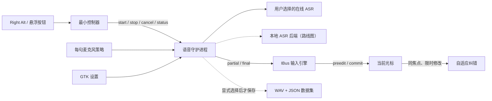

# Open Voice Input Linux 产品与发布设计

本文把技术架构、首次使用体验、公开演示和社区发布约束放在同一份可执行
设计中。它服务于中文用户优先的 Linux 公开测试，不代替
[架构文档](architecture.md)、[隐私说明](privacy.md)或
[发布流程](release-process.md)。

## 一句话定位

> **真正长在 Linux 输入法里的语音输入：按下快捷键，文字实时出现在当前
> 光标；不用剪贴板，能从修改中学习，训练数据归用户所有。**

英文辅助文案：

> **IBus-native voice typing for Linux. Live text at the caret, no clipboard
> hacks, with adaptive corrections and user-owned training data.**

首批用户是使用 Ubuntu、IBus、Rime，并经常混合中文和英文术语的开发者、
研究人员和重度文字工作者。当前线上识别由用户选择并自行配置的 ASR 服务提供；
火山引擎是默认且唯一用真实 Key 验收的路径，Qwen/OpenAI 仍是实验后端；
本项目不能写成“完全离线”“永久免费 ASR”或“已经支持本地训练”。

## 产品架构

必须长期保持的边界：

- IBus 引擎只负责当前输入上下文、preedit 和最终提交，不打开麦克风，也不
  接触云端 Key；
- 守护进程拥有麦克风、ASR 连接、纠错编译和可选数据采集，但不能自行选择
  目标应用；
- 控制器保留 Right Alt、Esc、悬浮按钮、托盘和开机启动，只通过私有 Unix
  socket 发有限命令，不复制一套录音、网络或密钥实现；
- 设置页是唯一面向普通用户的配置入口；私有配置、个人词表和数据目录不得
  进入 Git、Release、CI artifact 或演示素材；
- 当前云端识别和未来本地识别必须共享同一后端接口。切换后端必须发生在一
  次听写开始前，不能把已经录制的音频静默转给另一个后端；
- 采集记录必须区分 `provider_final`、`preferred_output`、局部
  `correction` 与经过确认的 `spoken_verbatim`，不能把供应商伪标签直接称为
  人工金标。

## 三分钟首次体验

公开 beta 的目标流程是：

1. 用户从 GitHub Release 下载适用于 Ubuntu 24.04 x86_64 的 `.deb`；
2. 系统软件中心或 `apt install ./包名.deb` 安装系统依赖和产品文件；
3. 用户从应用菜单打开设置，选择服务并填写该服务的 Key；
4. 设置页完成用户服务启用，并明确告诉用户如何使用 Right Alt；
5. 用户在浏览器、编辑器或聊天框中按 Right Alt，说出第一句话；
6. partial 在当前光标显示，authoritative final 原位提交；
7. 卸载软件包时移除受管程序文件，但保留用户 Key、词表、纠错和显式选择的
   数据集，除非用户另行删除。

Debian maintainer script 不得读取、打印或迁移用户 Key，也不得在
`postinst` 中替任意桌面用户启动录音。系统包负责部署不可变程序文件；首次
用户配置和服务启用仍由设置页在对应用户会话中完成。

## README 首屏结构

陌生用户应在 30 秒内获得以下信息：

1. 项目名与一句话结果；
2. 12–20 秒循环动画，展示“按键—说话—光标出字”；
3. 一个明显的 Ubuntu `.deb` 下载/安装入口；
4. 三项差异：IBus 原生、不用剪贴板；会从严格修改中学习；数据由用户选择
   是否保留；
5. 当前事实：Ubuntu 24.04、IBus、在线 ASR BYOK、alpha 限制；
6. 中文完整上手和英文辅助文档入口。

D-Bus ABI、SBOM、威胁模型、DJI USB 细节和构建可复现性仍然公开，但从首屏
移到“技术与信任”链接。它们是用户决定信任项目时的证据，不是第一次点击
时必须阅读的前置条件。

## 高星项目的参考边界

这里借鉴公开项目的信息设计，不复制文案、图片或品牌：

- [Handy](https://github.com/cjpais/Handy)：先展示“按一个键即可在任何地方
  说话输入”，再给平台下载；值得借鉴结果优先和多资产 Release，不把项目改
  成它的跨平台复制品；
- [VoiceInk](https://github.com/Beingpax/VoiceInk)：截图、短视频和竞品替代
  故事很清楚；值得借鉴可见效果，不照搬 macOS 原生界面；
- [OpenWhispr](https://github.com/OpenWhispr/openwhispr)：`.deb`、RPM、
  AppImage、DMG、EXE 让用户直接找到自己的平台；本项目先把一个 Ubuntu
  `.deb` 做可靠，再扩发行版；
- [nerd-dictation](https://github.com/ideasman42/nerd-dictation)：Linux-first、
  简单、可组合形成了长期口碑；本项目保留系统输入法深度，而不是为了追求
  功能数量牺牲可理解性；
- [Voxtype](https://github.com/peteonrails/voxtype)：用明确的 Linux、Wayland
  和性能指标建立技术位置；本项目只有在同一套公开 benchmark 跑通后才发布
  延迟、CPU 或准确率比较。

这些项目共同证明：许可证类型和内部功能数量不是首要转化因素。首页的一句
承诺、可见演示、真正的平台安装包和诚实限制，才决定访问者能否完成第一次
体验。Open Voice Input Linux 不应放弃 IBus/Rime 深度去追逐同质化的跨平台
剪贴板产品。

## 演示素材规范

首屏动画必须由仓库脚本从固定的虚构文本生成，禁止录入真实 Key、真实个人
词表、真实音频、桌面通知、用户名、文件路径或数据集 ID。建议脚本：

1. 空白编辑器，光标可见；
2. 右下角显示 `Right Alt` 被按下；
3. 逐步出现 `把 NLP 项目接到 Linux 输入法里` 的 preedit；
4. final 提交后将 `NLP` 改为 `ALT`，只表现这是一次用户修改；
5. 第二次虚构听写显示 `ALT` 被正确识别；
6. 结尾显示三个事实：`IBus 原生`、`不用剪贴板`、`数据由你选择`。

如果实际运行版本尚未把编辑反馈写回训练 JSON，动画不能表现这一步已经
完成。动画可以演示当前已经验证的自适应纠错行为，并在仓库说明中标为用
固定素材重现的产品流程，而不是一段真实用户录音。

同时准备一张 1200×600 社交预览图。GitHub 不会自动读取仓库内的图片作为
social preview，维护者需要在仓库 Settings 中手工上传生成的 PNG。

## 公开传播主题

第一个公开主题只讲一件事：

> Linux 语音输入为什么不应该依赖剪贴板和模拟粘贴。

后续主题再分别介绍：

- 如何在不监听全局键盘的情况下从一次明确修改中学习；
- 每句重新选择麦克风、设备掉线时回退，同时不改变播放设备；
- 如何分开保存云端老师结果、用户想要的文字、纠错和确认转写；
- 从云端老师积累私人语料，再评测 Whisper/Qwen ASR 个人适配器。

动态麦克风和数据采集都是重要能力，但不应覆盖首屏的核心结果。面对普通
用户应分别表达为：

> 每次听写选择当前最合适的麦克风；设备消失后，下一句自动回退。

> 数据采集默认关闭；启用后，WAV 和未审核的供应商结果只写到你选择的目录。

## 发布门槛

在进行一次集中宣传前至少满足：

- `.deb` 能在干净 Ubuntu 24.04 x86_64 上安装、升级、卸载；
- Release 中的 `.deb`、校验和和源码 commit 精确对应，且仍通过签名、SBOM
  和离线验证流程；
- 设置入口、Right Alt 控制器、状态提示和用户服务属于同一公开交付，不要求
  用户拼接两个不相关的项目；
- 至少 15 名外部测试者中有 12 名无需实时帮助完成安装，且至少 90% 完成第
  一次听写；
- GTK、Qt、Chromium/Electron 和终端至少各验证一个应用，X11/Wayland 分开
  记录；
- 自适应纠错演示在真实输入上下文端到端成功；如果训练反馈轨仍不完整，文案
  必须明确其边界；
- 所有公开演示和问题模板都提醒用户不要上传 Key、录音、真实 transcript 或
  私人词表。

## 中文优先的渠道顺序

1. 用 Bilibili 视频承载完整演示；
2. 在 V2EX“分享创造”、Linux.do、Rime/Ubuntu 中文社区分别发布与受众相关
   的技术说明，不复制同一篇广告；
3. 根据真实使用反馈整理知乎或少数派长文；
4. 英文版再面向 `r/linux`、`r/opensource`、`r/Ubuntu` 和开源
   Mastodon；
5. 等到无需注册即可体验本地后端，或云端配置已足够简单时，再做 Show HN。

发布帖应邀请安装测试和问题反馈，不要求交换 star，不购买 star，也不组织
集中点赞。Star 是安装成功和重复使用的结果，不是可以独立优化的产品功能。

## 观测指标

GitHub star 之外，每周记录：

- GitHub unique visitors 与渠道 referrer；
- 主安装包下载量，校验和下载不算安装；
- 自愿反馈的“完成第一次听写”数量和耗时；
- 七天后仍在使用的外部测试者；
- 外部 issue、Discussion 作者和贡献者数量；
- 安装失败、首次听写失败和 P0/P1 问题；
- issue 首次响应时间。

默认不在产品内添加遥测。若未来设计可选遥测，必须单独征得同意，且绝不包
含音频、转写、词表、Key、应用名或数据集路径。

## 阶段目标

| 阶段 | 交付 | 合理目标 |
| --- | --- | --- |
| 0–30 天 | `.deb`、首屏动画、统一控制器、真实应用矩阵、首批测试者 | 30–100 stars |
| 31–60 天 | 单一主题 beta、中文社区发布、快速修复安装问题 | 200–500 stars |
| 61–90 天 | 本地 ASR preview、可复现中英混说评测、更多发行版包 | 500–1000 stars |

这些数字是用于决定工作优先级的估算，不是增长承诺。若产品仍然是
“Ubuntu + 单一在线后端 + tar.gz alpha”，即使继续增加内部功能，公开增长
上限也会明显低于提供本地后端、发行版原生安装包和稳定日用体验的版本。
